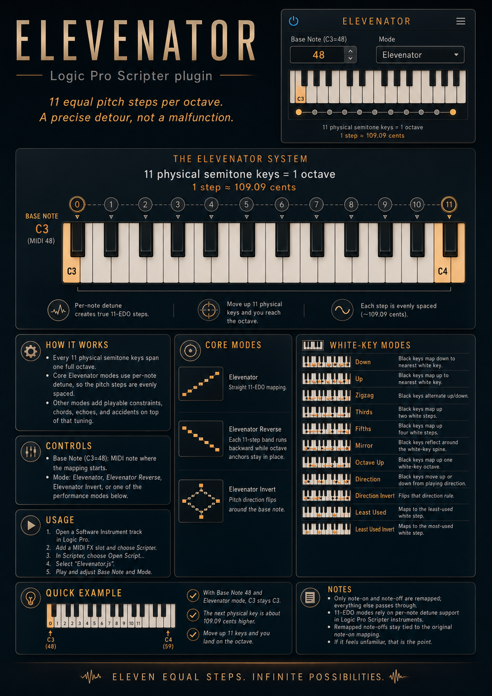

# Elevenator

Elevenator is a Logic Pro Scripter plugin that re-spaces the keyboard into 11 equal pitch steps per octave. Move up 11 physical semitone keys and the sound has climbed a full octave, so each step is about 109.09 cents instead of the usual 100.

## How it works

- Every 11 physical semitone keys span one full octave.
- Every mode ends in the same 11-EDO output, using per-note detune instead of skipped MIDI notes.
- The performance modes build playable constraints, chords, echoes, and accidents on top of that tuning.

## Controls

- **Base Note (C3=48):** The MIDI note number where the mapping starts.
- **Mode:** Elevenator, Elevenator Reverse, Elevenator Invert, or one of the performance modes below.

## Usage

1. Open the Software Instrument track in Logic Pro.
2. Add a MIDI FX slot and choose **Scripter**.
3. In the Scripter window, click the preset menu and choose **Open Script...**.
4. Select [Elevenator.js](Elevenator.js).
5. Play the keyboard and adjust **Base Note** and **Mode** to taste.

### White-key modes

White-key modes use a seven-note white-style spine inside each 11-key octave, and the notes they emit stay in the 11-EDO scale.

- **White Keys: Down** maps black keys down to the nearest white key.
- **White Keys: Up** maps black keys up to the nearest white key.
- **White Keys: Zigzag** alternates black keys up or down for a skewed contour.
- **White Keys: Thirds** maps black keys up two white steps.
- **White Keys: Fifths** maps black keys up four white steps.
- **White Keys: Mirror** reflects black keys around the white-key spine of the octave.
- **White Keys: Octave Up** maps black keys up one white-key octave.
- **White Keys: Direction** maps black keys up or down based on the order of the previous two note-ons.
- **White Keys: Direction Invert** flips the direction rule for the same motion.
- **White Keys: Least Used** maps black keys to the least-used white step in recent memory.
- **White Keys: Least Used Invert** maps black keys to the most-used white step.

### Chord modes

Each held key becomes the root of an 11-step-octave chord. Upper voices come in slightly softer for a more natural balance.

- **Chord: Major** plays a bright 11-EDO major triad.
- **Chord: Minor** plays a wide 11-EDO minor triad.
- **Chord: Power 5** plays an open root-fifth power chord using the closest 11-EDO fifth.
- **Chord: Sus4** plays a suspended fourth chord.
- **Chord: Maj7** plays a major seventh color.
- **Chord: Min7** plays a minor seventh color.
- **Chord: Quartal** stacks fourths above the root for a modern, ambiguous voicing.
- **Chord: Big Hands** spans an octave below to a twelfth above with root and fifth doubled.
- **Octave Spray** triggers the held key plus the octave above and below.
- **Chord: Dominant #9** plays a crunchy five-note dominant shape.
- **Chord: Crunch Cluster** stacks four adjacent 11-EDO steps for controlled dissonance.

### Harmony modes

- **Negative Harmony** reflects each pitch inside the 11-step octave.
- **Whole Tone Lock** snaps every input to the nearest whole-tone-like degree in the 11-step octave.
- **Pentatonic Lock** snaps every input to the nearest minor-pentatonic-like degree in the 11-step octave.

### Crazy modes

- **Drunk Pianist** offsets each new note by a random 11-EDO step in the range [-1, +1]. The offset is locked through the note-off so notes do not get stuck.
- **Mirror Trick** lets every other note use the normal 11-EDO mapping; the alternating notes reflect around the base note, creating skewed melodic contours.
- **Chaos: Chance Companion** adds one random 11-EDO harmony note, sometimes followed by a second delayed companion.

### Time-based modes

These modes use the host beat clock, so the transport should be playing for them to feel right.

- **Strum: Major Up** plays a bright 11-EDO major color with each voice delayed by a fraction of a beat, like a brushed chord.
- **Echo: 1/8 Cascade** plays the held key and two decaying eighth-note echoes that fire-and-forget on top of the held note.
- **Strum: Eleven Fan** brushes a wider six-note 11-EDO voicing from below the root to the octave above.
- **Echo: Spiral 11** sends four quick echoes upward by one 11-EDO step each time.

## Quick example

Default settings (Base Note 48, Elevenator mode) mean C3 is still C3, but the next physical key is about 109.09 cents higher. Move up 11 keys on your keyboard and you land on the octave.

Elevenator Reverse runs each 11-step octave band backward while keeping the octave anchors in place, so scalar lines fold back before snapping to the next octave.

Elevenator Invert flips pitch direction while keeping the 11-step octave, so higher keys fall and lower keys rise around the base note.

## Notes

- This script only remaps note-on and note-off events; everything else passes through.
- The 11-EDO modes rely on per-note detune support in Logic Pro Scripter instruments.
- Direction modes follow the trend of the previous two note-ons, falling back to current-vs-previous motion at the start of a phrase; note-off stays locked to the original mapping.
- Least-used modes follow recent white-key motion; ties rotate for more variance, and note-off stays locked to the original mapping.
- All remapped note-offs are tied to the note-on mapping, so switching modes while holding notes is less likely to leave stuck notes.
- If it feels unfamiliar, that is the point: a precise detour, not a malfunction.
